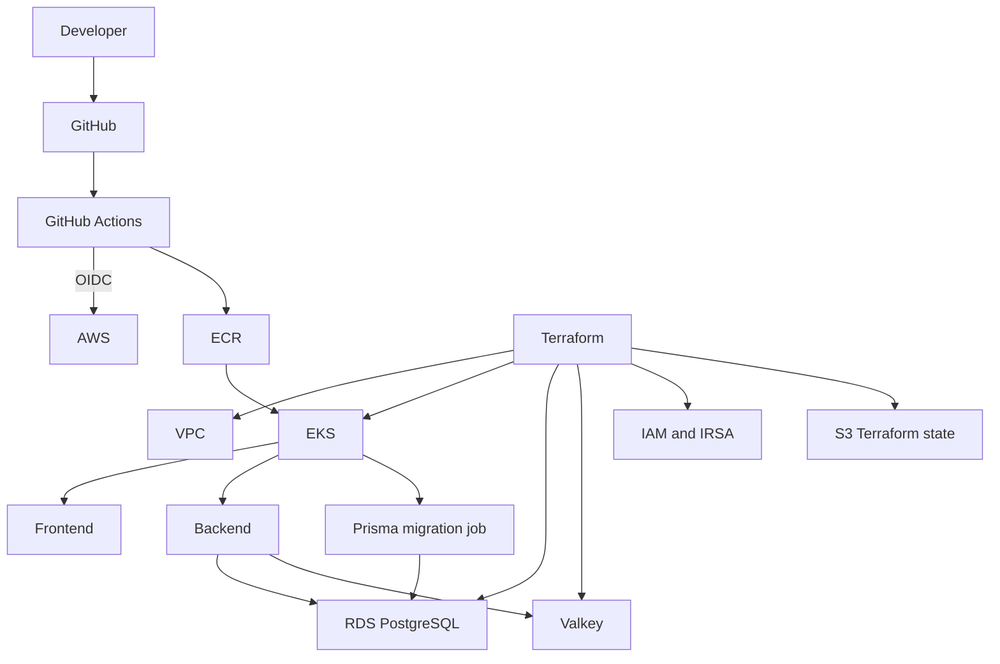

# Finance AI

Finance AI is a full-stack personal finance platform that combines deterministic
financial calculations with AI-assisted insights. The repository also serves as
a production-style Platform/DevOps implementation on AWS using Terraform, EKS,
Kubernetes, Helm, GitHub Actions, PostgreSQL, and Valkey.

## What It Does

- tracks income and expense transactions;
- manages budgets and financial goals;
- calculates cash-flow and spending insights;
- supports AI-assisted financial conversations; and
- requires confirmation before chat-initiated financial writes.

## Platform Highlights

- Terraform-managed AWS infrastructure with EKS workloads packaged by Helm
- immutable frontend and backend images published to ECR by GitHub Actions
- keyless GitHub OIDC authentication and backend IRSA workload identity
- private RDS PostgreSQL and ElastiCache Valkey
- verified RDS TLS trust and separate runtime/migration database identities
- a pre-install/pre-upgrade Prisma migration gate
- dependency-aware probes and locally validated Helm upgrade/rollback behavior

## Architecture



Terraform keeps application nodes in private subnets and data services in
isolated private-data subnets. Helm applies restricted security contexts,
resource budgets, ConfigMaps, external Secret references, Services, probes, and
the optional migration hook.

## Request and Runtime Flow

Requests flow from the user through the frontend and backend API to PostgreSQL
and Valkey, with an AI provider called only when configured.

`/livez` reports whether the backend process is alive. `/readyz` gates traffic
on shutdown state, PostgreSQL connectivity, and required Valkey connectivity.
This lets Kubernetes distinguish a running process from a workload that can
safely serve requests.

## CI/CD and Release Flow

1. Pull requests and pushes run frontend tests/builds, backend tests/builds,
   container builds, and Terraform validation.
2. On `main`, GitHub Actions exchanges its OIDC identity for the narrow AWS ECR
   publisher role; no long-lived AWS access key is stored in GitHub.
3. Frontend and backend images are tagged with the commit and workflow identity
   and published to their staging ECR repositories.
4. An operator supplies the reviewed image references to the Helm release. The
   repository does not currently run `helm upgrade` automatically.
5. When enabled, the Helm pre-install/pre-upgrade migration job runs the exact
   backend image before application resources roll out.
6. Readiness gates traffic after dependencies become available.
7. The disposable local Kubernetes validation exercises a failed upgrade and
   rollback to the last healthy Helm revision.

## AWS Infrastructure

| Component      | Purpose                                                                  |
| -------------- | ------------------------------------------------------------------------ |
| VPC            | Public, private-application, and isolated private-data subnet boundaries |
| EKS            | Managed Kubernetes control plane and private worker nodes                |
| ECR            | Immutable, scan-on-push frontend and backend image repositories          |
| RDS PostgreSQL | Private encrypted system-of-record database                              |
| Valkey         | Private TLS/IAM-authenticated cache and coordination store               |
| IAM            | GitHub OIDC publisher role, cluster roles, and backend IRSA identity     |
| S3             | Versioned, encrypted Terraform remote state with native lock files       |

Staging and production are separate Terraform roots with distinct state keys
and environment inputs.

## Security Model

- GitHub Actions uses OIDC instead of stored AWS access keys.
- The backend uses IRSA for its narrowly scoped AWS permissions.
- RDS and Valkey accept traffic only from the application network boundary;
  database connections verify TLS with a system-plus-RDS CA bundle.
- Application credentials are supplied through external Kubernetes Secrets,
  not Helm values or static container credentials.
- The runtime database role receives application DML but cannot perform schema
  migrations or access the Prisma migration ledger.
- The dedicated migration role owns Prisma objects; its Helm job uses a separate
  Secret and ServiceAccount and receives no AWS credentials.
- Containers run with restricted security contexts; the backend runs non-root.

See [Security](docs/SECURITY.md) and
[Database setup](backend/DATABASE_SETUP.md) for implementation details.

## Database Migrations

The active Prisma schema targets PostgreSQL. Its checked-in history begins with
a reviewed PostgreSQL baseline under `backend/prisma/migrations/`.

The migration model is forward-only:

- migrations are generated and reviewed outside deployed environments;
- a dedicated migrator runs `prisma migrate deploy` as a Helm hook;
- the application runtime does not own DDL or `_prisma_migrations`; and
- failed migrations stop the release because the job has `backoffLimit: 0`.

The original SQLite migrations remain in
`backend/prisma/legacy-sqlite-migrations/` as historical evidence and are not
part of the active chain.

## Reliability

- `/livez` process health and `/readyz` dependency health
- PostgreSQL and Valkey readiness checks
- Kubernetes liveness/readiness probes
- CPU and memory requests/limits
- Valkey reconnect handling and graceful application shutdown
- immutable image references supported by the Helm chart
- single-attempt migration hooks before rollout
- tested local Helm upgrade failure and rollback

No SLA or production traffic claim is made by this repository.

## Repository Structure

```text
frontend/                 React application and UI tests
backend/                  Express API, Prisma schema, migrations, and tests
infra/terraform/          AWS modules and isolated environment roots
deploy/helm/              Application Helm chart and environment values
deploy/local/             Disposable local Kubernetes dependencies
scripts/                  Development and infrastructure validation scripts
docs/                     Security, architecture history, and design decisions
```

## Local Development

Prerequisites: Node.js 20 or newer, npm, and Docker.

```sh
npm ci
npm --prefix backend ci
cp backend/.env.example backend/.env
# Replace the example JWT/HMAC/CSRF values before use.
npm --prefix backend run db:generate
docker compose -f backend/docker-compose.yml up -d postgres redis
npm --prefix backend run db:migrate:deploy
npm run dev
```

The frontend defaults to `http://localhost:3000/api/v1`. Override it by copying
`frontend/.env.example` to `frontend/.env` when needed.

To stop the local data services:

```sh
docker compose -f backend/docker-compose.yml down
```

Local development does not require AWS. OpenAI is optional; without a usable
key, the default provider mode falls back to deterministic local behavior.

## Infrastructure Validation

The Terraform script runs formatting checks, backend-free initialization,
validation, and the repository's mocked Terraform tests without contacting AWS:

```sh
./scripts/terraform-validate.sh
```

Helm can be checked without a cluster:

```sh
helm lint deploy/helm/finance-ai -f deploy/helm/finance-ai/values-staging.yaml
helm template finance-ai-staging deploy/helm/finance-ai \
  --namespace finance-ai-staging \
  -f deploy/helm/finance-ai/values-staging.yaml >/dev/null
K8S_LOCAL_STATIC_ONLY=true ./scripts/k8s-local-validate.sh
```

The full `scripts/k8s-local-validate.sh` additionally creates a disposable kind
cluster, builds and loads images, deploys the chart, validates health behavior,
and exercises upgrade rollback.

## Deployment Notes

The repository contains reusable Terraform and Helm definitions, not production
credentials. Real `tfvars`, Terraform backend configuration, state, plans, and
application Secrets are ignored. Staging values contain non-secret infrastructure
identifiers such as an IAM role ARN and service endpoint names.

Applying Terraform, creating Kubernetes Secrets, and installing or upgrading a
shared Helm release are explicit operator actions outside the automated ECR
publishing workflow.

## Architecture Evolution

Finance AI originally used an EC2 and Docker Compose deployment before moving
toward Terraform, EKS, managed data services, and Helm. The migration boundaries
and retained engineering history are described in
[Migration from EC2 to EKS](docs/architecture/legacy-ec2-migration.md).

## Tech Stack

| Area     | Technologies                                          |
| -------- | ----------------------------------------------------- |
| Frontend | React, TypeScript, Vite, Tailwind CSS                 |
| Backend  | Node.js, Express, TypeScript, Prisma                  |
| Data     | PostgreSQL, Valkey                                    |
| Cloud    | AWS VPC, EKS, ECR, RDS, ElastiCache, IAM, S3          |
| Platform | Terraform, Docker, Kubernetes, Helm                   |
| CI/CD    | GitHub Actions, OIDC                                  |
| Security | IRSA, TLS, external Secrets, least-privilege DB roles |

## Current Limitations

- No workflow currently performs an automatic Helm deployment to staging.
- DNS, public ingress, TLS certificates, and environment Secrets require
  environment-specific operator configuration.
- OpenAI-backed behavior requires an externally supplied API key.
- SMTP is required for production email OTP delivery; production SMS delivery
  is not yet integrated.
- Observability is currently limited to structured logs, Kubernetes health
  checks, and AWS-managed service logs; no application metrics/tracing stack is
  included.

## License

No license has been selected for this repository. Until one is added, normal
copyright restrictions apply.
